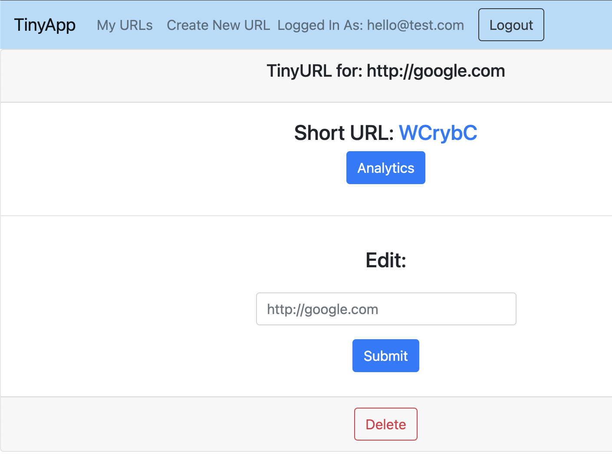

# TinyApp Project

TinyApp is a full stack web application built with Node and Express that allows users to shorten long URLs (à la bit.ly).

This project provides edit and delete functions, as well as analytics showing how many times a shortened URL has been visited, how many unique visitors have used this URL, and lists of these visitors and their visits.

## Final Product

Users must login or register prior to being able to access site functions:

Creating a shortened URL requires a user to input text. Validation of a valid URL does not take place, and the user can enter any address.

Following submission of a URL for shortening, user is redirected to the viewing page for that URL, where they can edit the url it directs to, or completely delete the shortened URL entry.

When the user returns to their main page, they will see a list of all shortened urls they have created, and be able to access the details and analytics of each url.

The analytics page of each url shows how many times a url has been visited and how many unique visitors have used that url. A list of every independent visit is also generated at the bottom of the page.

## Dependencies

- Node.js
- Express
- EJS
- bcrypt
- body-parser
- cookie-session
- method-override

## Getting Started

- Install all dependencies (using the `npm install` command).
- Run the development web server using the `node express_server.js` command.